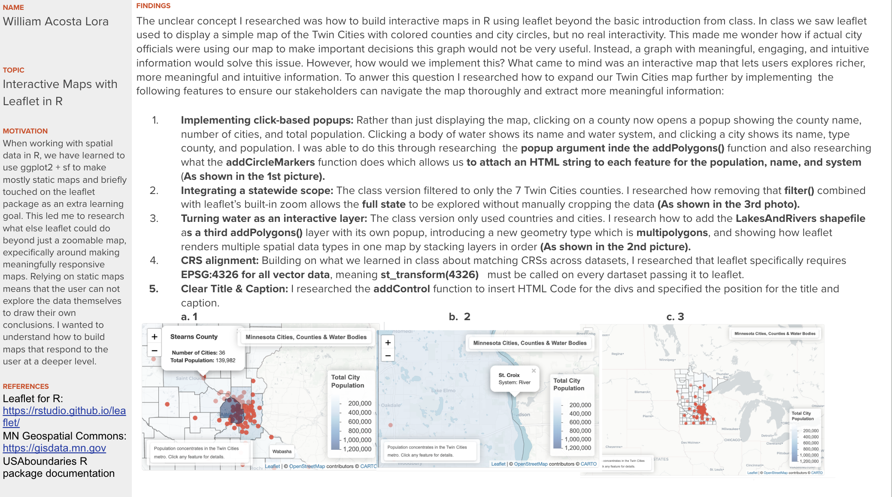

## Exam 1 Report

```{r, echo=FALSE, out.width="50%", fig.cap="My Exam 1 Report"}

```

```{r}
library(tidyverse)
library(sf) # tools for working with spatial vector data (GIS functionality, mapping)
library(elevatr) # access to raster elevation maps
library(terra)
library(stars)
library(tidycensus) # spatial data for the US with census information
library(USAboundaries) # access to boundaries for US states, counties, zip codes, and congressional districts 
```

```{r}
library(leaflet)

mn_counties <- USAboundaries::us_counties(resolution = "high", states = "Minnesota") |>
  st_transform(4326)

mn_cities <- st_read("../data/shp_loc_pop_centers/city_and_township_population_centers.shp") |>
  st_transform(4326)

mn_water <- st_read("../data/shp_water_lakes_rivers/LakesAndRivers.shp") |>
  st_transform(4326)

# Safely fix duplicate state_name columns
if (sum(names(mn_counties) == "state_name") > 1) {
  names(mn_counties)[names(mn_counties) == "state_name"] <- c("state_name1", "state_name2")
}

# Spatial join: attach county info to each city
cities_with_county <- st_join(mn_cities, mn_counties)

# Summarize per county
county_stats <- cities_with_county |>
  st_drop_geometry() |>
  group_by(name) |>
  summarize(
    num_cities = n(),
    total_pop = sum(Population, na.rm = TRUE)
  )

# Join stats back onto counties
mn_counties <- mn_counties |>
  left_join(county_stats, by = "name") |>
  mutate(
    num_cities = replace_na(num_cities, 0),
    total_pop = replace_na(total_pop, 0)
  )

pal <- colorNumeric(palette = "Blues", domain = mn_counties$total_pop)

leaflet() |>
  addProviderTiles("CartoDB.Positron") |>
  
  # Water layer
  addPolygons(
    data = mn_water,
    fillColor = "#a8d5e2",
    fillOpacity = 0.8,
    color = "#5b9ab5",
    weight = 0.5,
    popup = ~paste0(
      "<b>", NAME_DNR, "</b><br>",
      "System: ", SYSTEM
    )
  ) |>
  
  # County layer
  addPolygons(
    data = mn_counties,
    fillColor = ~pal(total_pop),
    fillOpacity = 0.5,
    color = "#333333",
    weight = 1,
    highlightOptions = highlightOptions(
      color = "white", weight = 3,
      fillOpacity = 0.8, bringToFront = TRUE
    ),
    label = ~name,
    popup = ~paste0(
      "<b style='font-size:14px'>", name, " County</b><br><br>",
      "️ <b>Number of Cities:</b> ", num_cities, "<br>",
      " <b>Total Population:</b> ", format(total_pop, big.mark = ",")
    )
  ) |>
  
  # City markers
  addCircleMarkers(
    data = mn_cities |> filter(Population >= 10000),
    radius = 5,
    color = "#e74c3c",
    fillOpacity = 0.9,
    stroke = FALSE,
    popup = ~paste0(
      "<b>", Name, "</b><br>",
      "Type: ", CTU_Type, "<br>",
      "County: ", County, "<br>",
      "Population: ", format(Population, big.mark = ",")
    )
  ) |>
  
  addLegend(
    position = "bottomright",
    pal = pal,
    values = mn_counties$total_pop,
    title = "Total City<br>Population",
    labFormat = labelFormat(big.mark = ",")
  ) |>

  # Title
  addControl(
        html = "<div style='background:rgba(255,255,255,0.85); padding:5px 10px; 
            border-radius:5px; font-size:13px; font-weight:bold;
            box-shadow: 0 1px 4px rgba(0,0,0,0.2);'>
            Minnesota Cities, Counties & Water Bodies</div>",
    position = "topright"
  ) |>

  # Caption
  addControl(
 html = "<div style='background:rgba(255,255,255,0.85); padding:4px 8px;
            border-radius:5px; font-size:10px; color:#666;
            box-shadow: 0 1px 4px rgba(0,0,0,0.2); max-width:200px;'>
            Population concentrates in the Twin Cities metro. 
            Click any feature for details.</div>",
    position = "bottomleft"
  )
```
